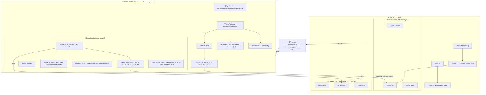

# Referencia Técnica: Visor IFC

## Arquitectura implementada

El visor IFC de GeoIFC Assets es un **subproceso Python independiente** gestionado desde el proceso QGIS mediante `QProcess`. La ventana del subproceso se embebe directamente en la pestaña "IFC Viewer" del dock principal.

Las decisiones arquitectónicas que justifican este diseño están formalizadas en **ADR-008** (subproceso + SwiftShader + polling HTTP) y **ADR-009** (embedding en dock).

---

## Diagrama general



---

## Componentes Python

### `_ensure_swiftshader_flag()` — `viewer.py`

Configura las variables de entorno de Chromium **antes** de que se cree ningún widget Qt:

```python
os.environ["QTWEBENGINE_CHROMIUM_FLAGS"] = (
    "--enable-unsafe-swiftshader --ignore-gpu-blocklist"
)
```

Se llama desde `initGui()` del plugin. El subproceso hereda estas variables porque `_launch_subprocess()` copia `os.environ` al `QProcessEnvironment`.

**Por qué no funciona en proceso:** Chromium solo lee `QTWEBENGINE_CHROMIUM_FLAGS` al arrancar el proceso Chromium. Si QGIS ya ha inicializado algún `QWebEngineView` (habitual con plugins de mapas web), el proceso Chromium ya existe y las flags son ignoradas.

---

### `_find_python_executable()` — `viewer.py`

En QGIS, `sys.executable` apunta al binario del host (`qgis-bin.exe`), no al intérprete Python. Pasar ese valor a `QProcess.start()` hace que QGIS interprete los argumentos como rutas de datos, produciendo errores. Esta función localiza el intérprete real:

```
qgis_bin/python3.exe   ← instalación OSGeo4W Windows (prioridad máxima)
qgis_bin/python.exe
sys.prefix/python.exe
sys.prefix/bin/python3  ← Linux / macOS
sys.prefix/bin/python
which("python3")         ← fallback del sistema
```

---

### `IfcHttpServer` — `viewer.py`

Servidor `ThreadingHTTPServer` que corre en un hilo demonio. Expone tres recursos:

| Ruta | Descripción |
|---|---|
| `GET /index.html` | Fichero HTML del visor (delegado a `SimpleHTTPRequestHandler`) |
| `GET /assets/*` | Bundle JS de viewer.ts compilado por Vite |
| `GET /modelo.ifc` | Sirve el fichero IFC activo desde disco local sin copiarlo |
| `GET /current.json` | `{"version": N, "ifc_url": "/modelo.ifc" \| null}` — counter de versión |

`set_ifc_path(path)` incrementa el contador de versión. El JS detecta el cambio en el siguiente ciclo de polling y solicita el nuevo IFC.

**Thread-safety:** un `threading.Lock` protege la escritura de `_ifc_path` y `_version`, ya que el hilo del servidor y el hilo principal de QGIS acceden concurrentemente.

---

### `IfcViewerDock` — `viewer.py`

Gestiona el ciclo de vida del subproceso y la integración con el layout del dock.

**Atributos clave:**

| Atributo | Tipo | Descripción |
|---|---|---|
| `_proc` | `QProcess \| None` | Proceso del subproceso visor |
| `_container` | `QWidget \| None` | Widget container del embedding |
| `_viewer_placeholder` | `QLabel` | Label visible mientras el subprocess arranca o está parado |
| `_http_server` | `IfcHttpServer` | Servidor HTTP embebido |

**Ciclo de vida del subproceso:**

```
__init__()
  └── _launch_subprocess()
        └── QProcess.start(python3.exe, [webviewer_app.py, puerto, url])

QProcess.readyReadStandardOutput → _on_proc_stdout()
  └── línea "READY:<win_id>" → _embed_subprocess_window(win_id)
        ├── QWindow.fromWinId(win_id)
        ├── QWidget.createWindowContainer(foreign_window, self.widget)
        └── layout.insertWidget(1, container, 1)

open_reference(reference)
  ├── _http_server.set_ifc_path(local_path)  ← incrementa versión
  └── si _proc is None → _launch_subprocess()  ← reinicio bajo demanda

QProcess.finished → _on_proc_finished()
  ├── _clear_embedded_window()
  └── self._proc = None

destroy()  (llamado en unload del plugin)
  ├── _stop_subprocess()
  │     ├── _clear_embedded_window()  ← PRIMERO: libera referencia QWindow
  │     └── proc.kill() + waitForFinished(2000)
  └── _http_server.stop()
```

**Regla de orden crítica:** `_clear_embedded_window()` **siempre** se llama **antes** de `proc.kill()`. Si se mata el proceso antes de liberar la referencia Qt a su HWND, se puede producir un acceso a memoria nativa inválida.

---

### `webviewer_app.py`

Script de entrada del subproceso. **No importa nada de `qgis.*`** (requeriría un contexto QGIS activo). Importa PyQt6 o PyQt5 directamente según disponibilidad:

```python
try:
    from PyQt6.QtWebEngineWidgets import QWebEngineView
    ...
except ImportError:
    from PyQt5.QtWebEngineWidgets import QWebEngineView
    ...
```

**Secuencia de arranque:**

```
1. QApplication(sys.argv[:1])
2. app.setQuitOnLastWindowClosed(False)
3. view = _ViewerWindow()          ← QWebEngineView con closeEvent override
4. view.resize(1280, 800)
5. view.load(QUrl(viewer_url))
6. view.show()                     ← crea el HWND nativo
7. view.hide()                     ← oculta antes del embedding (sin flash visual)
8. win_id = int(view.winId())
9. print(f"READY:{win_id}")        ← notifica al proceso QGIS
10. view.page().renderProcessTerminated.connect(_on_render_crash)
11. app.exec()
```

El `view.hide()` en el paso 7 es importante: el HWND ya existe (necesario para `winId()`), pero la ventana no es visible para el usuario. El dock QGIS la embebe en decenas de milisegundos, momento en que aparece directamente en el panel sin flash de ventana flotante.

**Gestión de crashes del renderer:**

```python
def _on_render_process_terminated(status, exit_code):
    view.load(QUrl(url))  # Recarga la página, Chromium reinicia el renderer
```

`setQuitOnLastWindowClosed(False)` evita que ese crash temporal (que puede cerrar y reabrir la `QWebEngineView` internamente) termine el subproceso.

---

## Componentes TypeScript / JavaScript

### `viewer.ts` (compilado a `webviewer/assets/index.js` por Vite)

**Inicialización defensiva de WebGL:**

El renderer Three.js se inicializa con tres niveles de fallback para maximizar la compatibilidad:

```typescript
try {
    renderer = new THREE.WebGLRenderer({ canvas, antialias: true });
} catch {
    try {
        renderer = new THREE.WebGLRenderer({ canvas, antialias: false, powerPreference: "low-power" });
    } catch {
        const softCtx =
            canvas.getContext("webgl2", { failIfMajorPerformanceCaveat: false }) ||
            canvas.getContext("webgl",  { failIfMajorPerformanceCaveat: false });
        renderer = new THREE.WebGLRenderer({ canvas, context: softCtx, antialias: false });
    }
}
```

El tercer intento con `failIfMajorPerformanceCaveat: false` activa SwiftShader cuando las flags Chromium están configuradas, sin lanzar una excepción aunque el rendimiento sea software.

**`window.GeoIfcViewer` se define antes de inicializar WebGL** para que el polling pueda encontrarlo aunque la inicialización falle. Si WebGL falla, `openReference()` muestra el error en lugar de intentar renderizar.

**Polling `/current.json`:**

```typescript
let _pollVersion = -1;

async function pollCurrentIfc() {
    const data = await fetch("/current.json").then(r => r.json());
    if (data.version !== _pollVersion) {
        _pollVersion = data.version;
        if (data.ifc_url) await window.GeoIfcViewer.openReference({ modelUrl: data.ifc_url, ... });
        else clearModel();
    }
}

// Delay inicial 800 ms para que WASM inicialice, luego cada 1.5 s
setTimeout(() => { void pollCurrentIfc(); setInterval(() => void pollCurrentIfc(), 1500); }, 800);
```

**Compatibilidad web-ifc 0.0.77:**

En esa versión algunos objetos (`FlatMesh`, `IfcGeometry`) son stack-allocated y no exponen `delete()`. Se usa optional chaining:

```typescript
geometry.delete?.();
flatMesh.delete?.();
```

---

## Flujo de selección de feature → visor

```
1. Usuario selecciona feature en QGIS
2. plugin._select_feature(layer_id, feature_id)
3. feature_reader.read_from_feature(layer, feature)
        → IfcReference(kind=URL, value="D:\...\building.ifc")
4. viewer_dock.open_reference(reference)
5. _local_path_from_reference(reference)
        → "D:\...\building.ifc"  (ruta local aunque kind=URL)
6. http_server.set_ifc_path("D:\...\building.ifc")
        → _version += 1
7. [si _proc is None] → _launch_subprocess()

--- Polling del subproceso (≤1.5 s) ---

8. fetch /current.json → {"version": 2, "ifc_url": "/modelo.ifc"}
9. version cambia → openReference({modelUrl: "/modelo.ifc"})
10. fetch /modelo.ifc → stream del fichero IFC desde disco
11. web-ifc parsea el IFC (WASM)
12. Three.js renderiza la geometría
```

---

## Detección de rutas locales en `ifc_url`

El campo `ifc_url` puede contener tanto URLs remotas como rutas locales de fichero (comportamiento habitual en capas de prueba). La función `_local_path_from_reference()` distingue ambos casos:

```python
def _local_path_from_reference(reference: IfcReference) -> str:
    value = reference.value
    if value.startswith("http://") or value.startswith("https://"):
        return ""   # URL remota: no soportada todavía
    return value    # Ruta local: se sirve vía /modelo.ifc
```

Las URLs remotas se registran como advertencia y el servidor no expone `/modelo.ifc`; el visor muestra "Select a feature in QGIS to load an IFC."

---

## Dependencias técnicas

| Componente | Tecnología | Notas |
|---|---|---|
| Gestión subprocess | `QProcess` (qgis.PyQt.QtCore) | Sin `subprocess.Popen`; permite captura de stdout por señales Qt |
| Embedding ventana | `QWindow.fromWinId` + `QWidget.createWindowContainer` | Qt5/Qt6, cross-platform |
| Servidor HTTP | `http.server.ThreadingHTTPServer` | Nativo Python, sin dependencias externas |
| Runtime JS IFC | `web-ifc` 0.0.77 (WASM, bundleado offline) | No requiere conexión a internet |
| Renderizado 3D | `Three.js` r177+ (bundleado offline) | Con fallback SwiftShader |
| Build frontend | Vite + TypeScript | `npm run build:webviewer` → `webviewer/assets/index.js` |
| QGIS compatible | QGIS 3 LTR + QGIS 4.x | PyQt5 / PyQt6 via bloque try/except en webviewer_app.py |

---

## Árbol de elementos IFC (Fase A)

Implementado en `viewer.ts`. Permite explorar los elementos del modelo agrupados por categoría IFC, hacer zoom al seleccionar un elemento y consultar sus atributos y PropertySets.

### Estructura del panel lateral

El panel lateral (`<aside class="viewer-panel">`) está organizado en cuatro zonas con `display: flex; flex-direction: column`:

```
.panel-info     — fuente activa (source-name)
.panel-tree     — árbol de categorías (flex: 1, overflow-y: auto)
.panel-props    — panel de propiedades (max-height: 45%, hidden por defecto)
.panel-status   — estado actual (source-status)
```

### Índice de PropertySets (`buildPropSetIndex`)

Se construye **una sola vez** cuando se carga el modelo, antes del árbol de elementos. Recorre todas las entidades `IFCRELDEFINESBYPROPERTIES` del modelo con `GetLineIDsWithType` (devuelve `Vector<number>` con `.size()/.get(i)`) y construye un mapa inverso:

```typescript
propSetIndex: Map<expressId, number[]>  // expressId del elemento → lista de expressIds de PropertySets
```

Esto evita tener que recorrer todas las relaciones en cada clic de elemento (~O(1) por clic en lugar de O(N_relations)).

Los valores REF de `RelatedObjects` son objetos `{ type: 5, value: expressID }`. La función `resolveRef` extrae el `value` numérico de forma defensiva.

### Índice de elementos (`buildElementIndex`)

Recorre los meshes ya en escena (almacenados en `modelGroup`) para extraer los `expressID` únicos. Para cada uno llama a `api.GetLine(modelId, expressId, false)` y extrae:

- `Name` — mediante `extractAttrValue` que maneja objetos web-ifc `{ type, value }`
- `type` — código numérico de la clase IFC; convertido a string de categoría mediante `CATEGORY_NAMES`

Los elementos se agrupan en un `Map<categoria, IFCElement[]>` ordenado alfabéticamente por categoría y por nombre dentro de cada categoría.

**Categorías reconocidas (28 tipos IFC mapeados):**

| Categoria | Tipos IFC incluidos |
|---|---|
| Walls | IFCWALL, IFCWALLSTANDARDCASE |
| Doors | IFCDOOR, IFCDOORSTANDARDCASE |
| Windows | IFCWINDOW, IFCWINDOWSTANDARDCASE |
| Slabs / Floors | IFCSLAB, IFCPLATE |
| Beams | IFCBEAM |
| Columns | IFCCOLUMN, IFCCOLUMNSTANDARDCASE |
| Members / Frames | IFCMEMBER |
| Roofs | IFCROOF |
| Stairs | IFCSTAIR, IFCSTAIRFLIGHT |
| Ramps | IFCRAMP |
| Railings | IFCRAILING |
| Coverings | IFCCOVERING |
| Curtain Walls | IFCCURTAINWALL |
| Furniture | IFCFURNISHINGELEMENT |
| Spaces | IFCSPACE |
| Storeys | IFCBUILDINGSTOREY |
| Foundations | IFCPILE, IFCFOOTING |
| Generic Elements | IFCBUILDINGELEMENTPROXY |
| MEP (varios) | IFCFLOW*, IFCDUCT*, IFCPIPE* |
| Other | cualquier tipo no mapeado |

### Renderizado del árbol (`renderTree`)

El árbol se genera como fragmento DOM con elementos `<details class="tree-cat" open>` nativos de HTML. No se usa ningún framework:

```html
<details class="tree-cat" open>
  <summary>
    <span class="cat-label">Walls</span>
    <span class="cat-count">12</span>
  </summary>
  <ul class="tree-list">
    <li><button class="tree-item" data-eid="42" title="...">Basic Wall:Interior</button></li>
    ...
  </ul>
</details>
```

El uso de `<details>` nativo permite colapsar/expandir categorías sin JavaScript adicional.

### Selección de elemento (`selectElement`)

Clic en un `<button class="tree-item">`:

1. Si el elemento ya está seleccionado → deselecciona (toggle), restaura materiales, oculta propiedades.
2. Marca `selected` en el botón y hace `scrollIntoView`.
3. Llama a `zoomToElement(expressId)` → calcula bounding box de los meshes con ese `expressID` y llama a `fitCameraToBox`.
4. Llama a `highlightElement(expressId)` → guarda materiales originales en `savedMaterials: Map<Mesh, Material>` y asigna `HIGHLIGHT_MAT` (naranja/amber, `MeshStandardMaterial`).
5. Llama a `renderProps` con los atributos directos y PropertySets del elemento.

`clearHighlight()` restaura todos los materiales desde `savedMaterials` y limpia el mapa. Se llama siempre antes de `clearModel()` para no disponer meshes con materiales en memoria.

### Lectura de atributos directos (`readDirectAttrs`)

`api.GetLine(modelId, expressId, false)` devuelve el objeto IFC como un diccionario JavaScript. Se filtran:

- Claves técnicas de estructura IFC (`expressID`, `type`, `OwnerHistory`, `ObjectPlacement`, `Representation`, relaciones inversas).
- Valores de tipo REF (`{ type: 5, value: N }`) — son apuntadores a otras entidades, no mostrables directamente.
- Arrays (conjuntos de relaciones).

Los valores válidos son strings, números o booleanos envueltos en `{ type, value }`. La función `extractAttrValue` los desenvuelve de forma defensiva.

### Lectura de PropertySets (`readPropertySets`)

Usa el índice preconstruido (`propSetIndex`) para obtener los IDs de PropertySets del elemento. Para cada PropertySet:

1. `api.GetLine(modelId, psId, false)` → extrae nombre y lista de propiedades (`HasProperties` o `Quantities`).
2. Para cada propiedad (`resolveRefArray → propId`):
   - `api.GetLine(modelId, propId, false)` → `IfcPropertySingleValue.NominalValue` o campos `*Value` de `IfcQuantity`.
   - `extractAttrValue` desenvuelve el valor final.

Solo se incluyen PropertySets que tengan al menos una propiedad con valor legible.

---

## Árbol espacial y selección por clic (Fase B)

### Selector de vista

La barra de modo (`#tree-mode-bar`) muestra dos botones: **Category** (vista plana por categoría, siempre disponible) y **Spatial** (jerarquía espacial, habilitado solo si el modelo tiene estructura espacial IFC). El visor activa Spatial automáticamente si la estructura está disponible.

### Árbol espacial (`buildSpatialTree`)

Se construye recorriendo dos tipos de relaciones:

| Relación | Campo origen | Campo destino | Significado |
|---|---|---|---|
| `IFCRELAGGREGATES` | `RelatingObject` | `RelatedObjects[]` | Descomposición espacial (Proyecto → Sitio → Edificio → Planta → Espacio) |
| `IFCRELCONTAINEDINSPATIALSTRUCTURE` | `RelatingStructure` | `RelatedElements[]` | Elementos físicos contenidos en cada planta o espacio |

El árbol se modela como `SpatialNode { expressId, name, typeLabel, typeCss, children[], elements[], totalCount }`. `totalCount` es recursivo: incluye los elementos de todos los sub-nodos.

Los datos de nombre y categoría de cada elemento se reutilizan desde el índice `elementsByCategory` (ya construido en Fase A), sin llamadas adicionales a `api.GetLine`.

El renderizado usa `<details class="tree-cat snode-{type}">` anidados. Los nodos de tipo `storey` están abiertos por defecto; los de tipo `space` están cerrados. Cada tipo recibe un color de fondo y etiqueta distintivos mediante CSS (`snode-project`, `snode-site`, `snode-building`, `snode-storey`, `snode-space`).

### Selección por clic en la escena 3D

`THREE.Raycaster` singleton (evita instanciación por evento). El listener de `mousedown` registra la posición inicial del ratón; el listener de `click` descarta el evento si el desplazamiento supera 4 px (indica arrastre de órbita/pan).

Cuando se detecta un clic real:
1. Se convierte la posición del ratón a coordenadas NDC.
2. `raycaster.intersectObjects(meshes, false)` devuelve las intersecciones ordenadas por distancia.
3. El primer hit proporciona el `expressID` del mesh → `selectElement(expressId)`.
4. `selectElement` abre los `<details>` ancestros en el árbol activo y hace scroll al botón.

---

## Transferencia BIM→GIS (Fase C)

El panel de propiedades añade un botón `→` a cada fila al pasar el ratón. Al hacer clic:

1. El JS llama a `transferProp(pset, key, value, btn)`, que hace `POST /transfer` al mismo origen HTTP.
2. `IfcHttpServer._receive_transfer` deserializa el cuerpo JSON y lo encola en `_pending_transfers` (protegido con `threading.Lock`).
3. Un `QTimer` a 250 ms en `IfcViewerDock._poll_transfers()` consume la cola en el hilo Qt principal.
4. Se invoca el callback `on_transfer` registrado en `GeoIfcAssetsPlugin._handle_transfer`.
5. `_show_transfer_dialog` abre un `QDialog` con un `QComboBox` editable que lista los campos del layer activo. Si se escribe un nombre nuevo, se crea el campo (`QgsField + layer.addAttribute`). El valor se escribe con `layer.changeAttributeValue`.

El botón queda verde (`prop-sent`) al completarse correctamente, o rojo (`prop-error`) si el POST falla.

---

## Limitaciones conocidas

- **HU-03 (selección de elemento IFC → QGIS):** Parcialmente implementada mediante POST `/transfer`. El canal inverso está activo para transferencia de propiedades; la selección de geometría IFC → highlight en capa GIS sigue pendiente.
- **URLs remotas:** El campo `ifc_url` con valor `http://` o `https://` muestra advertencia; el IFC no se carga. Pendiente de implementación.
- **Latencia:** El polling introduce un retraso de hasta 1,5 s entre selección de feature y actualización del visor.
- **Arranque inicial:** El subproceso tarda ~1-2 s en arrancar (Chromium + WASM). Durante ese tiempo el dock muestra el placeholder "Starting IFC viewer subprocess…".
- **Rendimiento en modelos grandes:** `buildElementIndex` hace una llamada `api.GetLine` por cada elemento con geometría. En modelos con >5.000 elementos únicos, la indexación puede añadir ~1-3 s tras la carga de geometría.
- **Elementos sin estructura espacial:** elementos con geometría pero sin `IFCRELCONTAINEDINSPATIALSTRUCTURE` no aparecen en el árbol Spatial. Siempre están disponibles en la vista Category.
